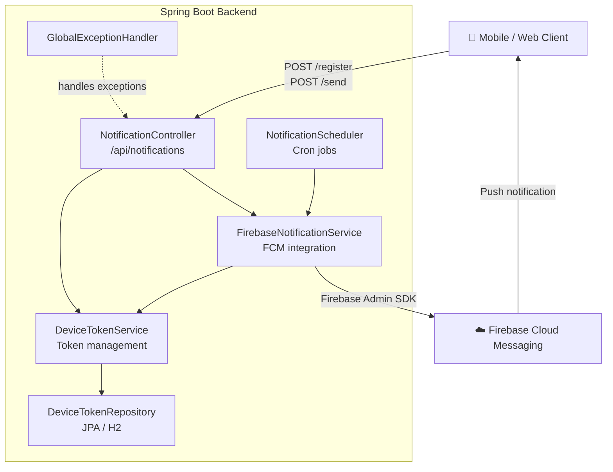

# FCM Push Notification Backend

Spring Boot backend for Firebase Cloud Messaging (FCM) — device token registration, on-demand push notifications, and scheduled daily broadcasts.

## Architecture



## Tech Stack

| Layer       | Technology                        |
|-------------|-----------------------------------|
| Framework   | Spring Boot 3.3.1                 |
| Language    | Java 17                           |
| Push        | Firebase Admin SDK 8              |
| Database    | H2 (in-memory)                    |
| API Docs    | SpringDoc OpenAPI (Swagger UI)    |
| Validation  | Jakarta Bean Validation           |
| Boilerplate | Lombok                            |

## Project Structure

```
fcm-backend/src/main/java/com/example/fcm_backend/
├── config/       # FirebaseConfig, WebConfig (CORS), OpenApiConfig
├── controller/   # NotificationController — REST endpoints
├── domain/       # DeviceToken — JPA entity
├── dto/
│   ├── request/  # RegisterTokenRequest, SendNotificationRequest
│   └── response/ # ApiResponse<T> — standardized response wrapper
├── exception/    # GlobalExceptionHandler, NotificationDeliveryException
├── repository/   # DeviceTokenRepository — Spring Data JPA
├── scheduler/    # NotificationScheduler — daily cron broadcast
└── service/      # DeviceTokenService, FirebaseNotificationService
```

## Setup

### Prerequisites

- Java 17+
- Maven 3.8+
- A Firebase project with Cloud Messaging enabled

### 1. Get Firebase credentials

1. Open [Firebase Console](https://console.firebase.google.com) → Project Settings → Service Accounts
2. Click **Generate new private key** and download the JSON file
3. Export the path as an environment variable:

```bash
export GOOGLE_APPLICATION_CREDENTIALS="/path/to/serviceAccountKey.json"
```

> The backend uses [Application Default Credentials (ADC)](https://cloud.google.com/docs/authentication/application-default-credentials), the standard Google authentication mechanism. When deployed to GCP/Cloud Run, no file is needed — credentials are picked up automatically from the environment.

### 2. Run

```bash
cd fcm-backend
./mvnw spring-boot:run
```

Server starts at `http://localhost:8080`.

### 3. Swagger UI

```
http://localhost:8080/swagger-ui.html
```

## API Reference

### Register Device Token

```http
POST /api/notifications/register
Content-Type: application/json

{
  "token": "<FCM device token>"
}
```

Registers the token (idempotent) and sends a welcome notification to the device.

### Send Notification

```http
POST /api/notifications/send
Content-Type: application/json

{
  "token": "<FCM device token>",
  "title": "Hello",
  "body": "World"
}
```

### Response Format

All endpoints return a consistent `ApiResponse<T>` envelope:

```json
{
  "success": true,
  "message": "Notificação enviada com sucesso",
  "data": null
}
```

Errors follow the same shape with `"success": false` and the appropriate HTTP status code.

## Configuration

```properties
# Daily broadcast schedule (default: 9:00 AM)
notification.scheduler.daily-cron=0 0 9 * * *
```

## Scheduled Broadcasts

Every day at the configured time, the scheduler sends a push notification to all registered device tokens. Delivery failures per-device are logged and do not interrupt the broadcast.
