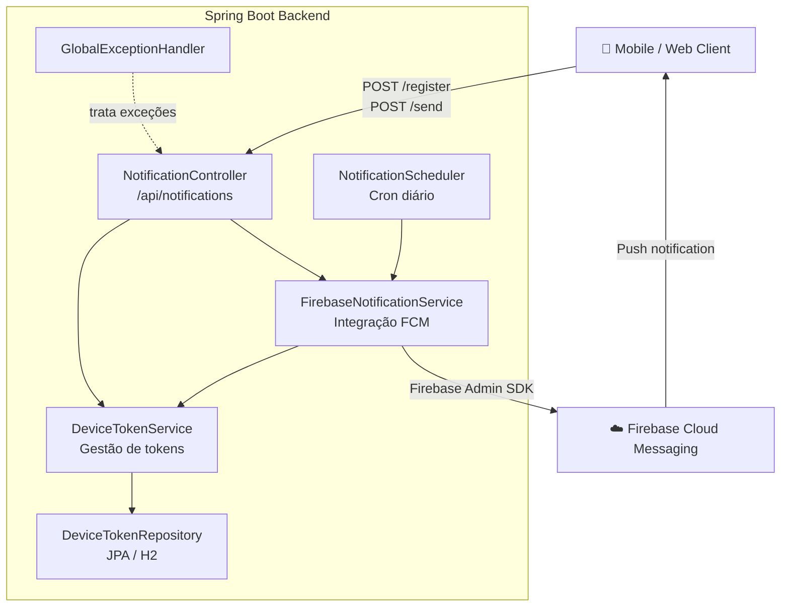

# FCM Push Notification Backend

Backend em Spring Boot para envio de push notifications via Firebase Cloud Messaging — registro de tokens, envio manual e broadcast agendado diário.

## Arquitetura



**Stack:** Java 17 · Spring Boot 3.3 · Firebase Admin SDK 8 · H2 · Swagger UI

## Como rodar

**Pré-requisitos:** Java 17+ e uma conta Firebase com Cloud Messaging habilitado.

**1. Configure as credenciais do Firebase**

No [Firebase Console](https://console.firebase.google.com) → Project Settings → Service Accounts → gere uma chave privada e exporte o caminho:

```bash
export GOOGLE_APPLICATION_CREDENTIALS="/caminho/para/serviceAccountKey.json"
```

**2. Suba o servidor**

```bash
cd fcm-backend
./mvnw spring-boot:run
```

Swagger UI disponível em `http://localhost:8080/swagger-ui.html`.

## Endpoints

| Método | Endpoint | Descrição |
|--------|----------|-----------|
| `POST` | `/api/notifications/register` | Registra token e envia notificação de boas-vindas |
| `POST` | `/api/notifications/send` | Envia notificação para um dispositivo específico |

Todas as respostas seguem o envelope `{ "success": true, "message": "...", "data": null }`.

## Configuração

O horário do broadcast diário é configurável em `application.properties`:

```properties
notification.scheduler.daily-cron=0 0 9 * * *
```
